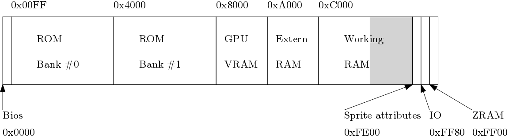

The Memory Unit
===============

Address Space
-------------

The memory bus of the Game Boy allow to address
up to 65 536 bytes.
Some part of these addresses correspond to read
only memory (ROM),
others to read and write memory
(RAM, for random acess memory)
and some are memory mapped devices.

Bellow you can find a short scheme summarizing
the repartition through the address space.



Many of those names migh sounds strange or even meaningless.
We describe each of this blocks, and give a quick summary
for their use.

*  __0x0000-0x00FF__ BIOS:
   
   The bios is the sequence of instructions executed immediately after
   the Game Boy's power on. It display the Nintendo Logo, check for
   the signature of the cartridge, and initialise divers registers.
   Once the Pointer Counter reach the address 0X0100, the bios is
   not acessible anymore, and the address plage is then mapped
   to the memory 0x0000-0x0100 of the carridge's ROM.
   
*  __0x0000-0x3FFF__ and __0x4000-0x7FFF__ ROM Bank:
   
   The ROM is the read only part of the cartridge's memory.
   It contains the code of the game (starting at address 0x0100),
   and the graphisms that will be loaded into the Game Boy's memory.

*  __0x8000-0x9FFF__ Video RAM:
   
   The Video RAM is the memory used by the GPU for drawing tiles
   and divers graphisms on the Game Boy's screen.

*  __0xA000-0xBFFF__ Cartridge's RAM:
   
   There is only few memory in the Game Boy console. Since some
   games might require more RAM, this address plage
   can refere to RAM physicaly stored in the cartridge.
   It can be read and write at almost any time by the CPU.
   
*  __0xC000-0xDFFF__ Working RAM:

  The Game Boy's internal RAM.
  Can be write and read at almost any time by the CPU.
  
*  __0xE000-0xFDFF__ Shadow RAM:

  Due to the internal wiring, the Working RAM is also available
  on this adress space. Reading and writing in this address
  plage have the same effect as reading or writing 8k bytes below.
  Notice that the last 512 bytes of the Working RAM are not duplicated.

* __0xFE00-0xFE9F__ Object Attribute Memory (OAM):

  The game boy can handle up to 40 sprites located at different locations
  of the Game Boy screen, for rendering characters, falling bricks in
  Tetris, etc. Their information is stored in this memory.

* __0xFF00-FF7F__ I/O:

  The state of the console pad, and many values controling the
  hardware behavior (sound, graphics, link cable...) are available
  at this addresses.

* __0xFF80-0xFFFE__ High RAM:

  The high RAM, also refered as the Zero Page,
  is a high speed RAM area. Most of the interactions
  between the harware and the programme occures in this
  address plage.

The MMU
-------

Now we are happy, because we have an idea of
the use of each block of this address space.
But how should we implement the read and write access
to this memory?
Remember that we also have to memory mapped devices
which require a specific code.
As you can imagine, reading the state of the joypad is a bit
different that just storing bytes in an array.

Since the processor cannot make a distinction between
reading from IO mapped device and simply the RAM,
an efficient way is to implement two
procedure.
The first one, `read_byte` (`rb` for short) will allow reading
from a specific memory address, wereas `write_byte`
(`wb` for short) will give a way to send values
through the memory bus.

We will also have to store the divers memories
(VRAM, RAM, ROM...) that can be accessed.
We will store this bunch of byte in arrays of bytes,
all of them contain in a structure.
To handle the different effect of reading
to address below 0x0100 when the bios is
active, we also add a boolean.

All this things together (this structure, and
the read and write functions) will be called
the memory unit, known as mmu for short.

Here is a rust code that give a basic skeleton
for our MMU.
``` {.rust}
#[derive(PartialEq, Eq, Clone, Debug)]
/// The MMU (memory)
struct Mmu {
    /// GB Bios
    bios  : Vec<u8>,
    /// 0000-3FFF    16KB ROM Bank 00
    rom   : Vec<u8>,
    /// 4000-7FFF    16KB ROM Bank 01
    srom  : Vec<u8>,
    /// 8000-9FFF   Video RAM
    vram  : Vec<u8>,
    /// A000-BFFF    8KB External RAM
    eram  : Vec<u8>,
    /// C000-CFFF    4KB Work RAM Bank 0 (WRAM)
    wram  : Vec<u8>,
    /// D000-DFFF    4KB Work RAM Bank 1 (WRAM)
    swram : Vec<u8>,
    /// FE00-FE9F    Sprite Attribute Table (OAM)
    oam   : Vec<u8>,
    /// FF80-FFFE    High RAM (HRAM)
    hram  : Vec<u8>,
    /// When true, reading below 0x100 access the bios.
    /// Once the booting sequence is finished, the value is
    /// turned to false. Then, rading below 0x100 read bytes from the rom field.
    bios_enabled : bool,
}
```

As you can see, type are given after the name of the field,
separated by a colon.
But the syntax remind close to the syntax
from the `C` language.
The derive instruction allow to inference
automatically the list of traits mentionned.
If you wonder what is a trait, you will
find the answer in few lines.

We can give default values to this structure.
For example, we can initialise `bios` to contain
the instructions from the Game Boy's boot sequence.
You can find the bios in Annex C, or many websites
dedicated to Game Boy development.

In `C++`, default values are
set thanks to a constructor.
In rust, default values use the default trait.
Traits are a way to define a collection
of polymorphic functions (similar to Java's interface)
that can be implemented (alltogether)
for ar arbitrary data type.
They are a tool to implement
_polymorphic functions_,
and can also be saw as a way to accomplish _overloading_.
Concretely, to create a sutructure with default
values, you implement the `Default` trait for
the type `MMU`.
The default trait have only one function, namely `default()`.
Once you implemented the trait, you can create a
structure with the line
```{.rust}
let my_struct : MMU = Default::default();
```

The choice of wich default function is called depend
on the return type expected.
Here, we ask explicitely for a type `MMU`.

We can implement the default trait il the following way:
``` {.rust}
impl Default for Mmu {
    fn default() -> Mmu { Mmu {
        bios : vec![
            0x31, 0xFE, ... // See Annex C
        ],
        rom   : empty_memory(0x0000..0x4000),
        srom  : empty_memory(0x4000..0x8000),
        vram  : empty_memory(0x8000..0xF000),
        eram  : empty_memory(0xA000..0xC000),
        wram  : empty_memory(0xC000..0xD000),
        swram : empty_memory(0xD000..0xE000),
        oam   : empty_memory(0xFE00..0xFEA0),
        hram  : empty_memory(0xFF80..0xFFFF),
        ier   : Default::default(),
        ifr   : Default::default(),
        bios_enabled : true,
    }
    }
}

// Replace the each element of the list by a null byte
fn empty_memory<I : Iterator>(range : I) -> Vec<u8> {
    range.map(|_| 0).collect()
}
```

Here, the `empty_memory` function simple compute an empty
vector of the length of the list it receive,
and `0..100` simply compute the list of 100 elements
`0, 1, ..., 99`.
It is just a fancy way to create a vector of a specific
length without having to compute explicitely his length,
which is the difference of the two numbers.

We can now implement our read and write memory functions.
```{.rust}
/// Read a byte from MMU (TODO)
fn rb(addr : u16, vm : &Vm) -> u8 {
    let addr = addr as usize;
    let mmu = &vm.mmu;
    // TODO Check if memory (vram / OAM) is acessible
    // depending of the state of gpu.gpu_mode:GpuMode.
    match addr {
        0x0000...0x00FF => if mmu.bios_enabled {mmu.bios[addr]}
        else {
            mmu.rom[addr]
        },
        0x0100...0x3FFF => mmu.rom[addr],
        0x4000...0x7FFF => mmu.srom[addr - 0x4000],
        0x8000...0x9FFF => mmu.vram[addr - 0x8000],
        0xA000...0xBFFF => mmu.eram[addr - 0xA000],
        0xC000...0xCFFF => mmu.wram[addr - 0xC000],
        0xD000...0xDFFF => mmu.swram[addr - 0xD000],
        0xE000...0xEFFF => mmu.wram[addr - 0xE000],
        0xF000...0xFDFF => mmu.swram[addr - 0xF000],
        0xFE00...0xFE9F => mmu.oam[addr - 0xFE00],
        0xFF80...0xFFFE => mmu.hram[addr - 0xFF80],
        // Otherwise, it should be an IO
        _ => io::dispatch_io_read(addr, vm),
    }
}

/// Write a byte to the MMU at address addr (TODO)
fn wb(addr : u16, value : u8, vm : &mut Vm) {
    let addr = addr as usize;
    // TODO Check if memory (vram / OAM) is acessible
    // depending of the state of gpu.gpu_mode:GpuMode.
    match addr {
        0x0000...0x7FFF => return, // ROM is Read Only
        0x8000...0x9FFF => vm.mmu.vram[addr - 0x8000] = value,
        0xA000...0xBFFF => vm.mmu.eram[addr - 0xA000] = value,
        0xC000...0xCFFF => vm.mmu.wram[addr - 0xC000] = value,
        0xD000...0xDFFF => vm.mmu.swram[addr - 0xD000] = value,
        0xE000...0xEFFF => vm.mmu.wram[addr - 0xE000] = value,
        0xF000...0xFDFF => vm.mmu.swram[addr - 0xF000] = value,
        0xFE00...0xFE9F => {
            let index = addr - 0xFE00;
            vm.mmu.oam[index] = value;
            update_sprite(index, value, vm);
        },
        0xFF80...0xFFFE => vm.mmu.hram[addr - 0xFF80] = value,
        // Otherwise, it should be an IO
        _ => io::dispatch_io_write(addr, value, vm),
    }
    if addr == 0xFF01 {unsafe {
        debug = value;}
    }
    // Debug test roms
    if addr == 0xFF02 && value == 0x81 {unsafe {
        print!("{}", debug as char);
    }}

}
TODO
```

Notice that if we want to read 16 bit, we can just call
twice the `rb` method and glue the values with the following
binary operation:

```{.rust}
// Combine two input bytes h and l into a 16bit integer containing h:l
fn w_combine(h : u8, l : u8) -> u16 {
    (h as u16) << 8 | (l as u16)
}
```

Symmetrically, for writing a 16bits register, we can first break it in two
8bits values:

```{.rust}
// Break the higher and lower part of the input 16bit integer into h:l
fn w_uncombine(hl : u16) -> (u8, u8) {
    ((hl >> 8) as u8, hl as u8)
}
```

and then call `wb` on each.
```{.rust}
fn ww(addr : u16, value : u16, vm : &mut Vm) {
    let (h, l) = w_uncombine(value);
    wb(addr, l, vm);
    wb(addr + 1, h, vm);
}
```

Loading the rom
---------------

Rom files are backup of the data stored in the Nintendo Game Boy's cartridge.
At this time, memory was very expensive.
It was both difficult to have huge amount of memory and memory chips was costly.
Therefor, cartridge has diferent sizes.
The smallest ones, like tetris, had a single "memory bank".
As a start, we will only load the lightweigh games like Tetris which are
usualy stored in a file with extension `.gb`.

The following code open a `.gb` file, check it's size and
if it seams compatible, load it.

```{.rust}
/// Load a .gb file into the Mmu struct
fn mmu_from_rom_file(filename : String) -> Result<Mmu> {
    let mut file = try!(File::open(filename));

    let mut contents : Vec<u8> = Vec::new();

    let number_of_bytes = try!(file.read_to_end(&mut contents));

    match number_of_bytes {
        0x8000 => {
            let mmu = Mmu {
                rom : contents[0x0000..0x4000].to_vec(),
                srom : contents[0x4000..0x8000].to_vec(),
                .. Default::default()
            };
            return Ok(mmu);
        }
        _ => return Err(Error::new(ErrorKind::Other, "Wrong file size"))
    }
}
```

Here, we need to explain what is this `try!` macro and the `Ok`/`Err`
constructors.
The `File::open` method return a `Result<File>`.
A `Result<T>`, where `T` is any arbitrary type, is either an `Ok(value : T)` or
a `Err(error : Error)`.
Depending on the success or failure of `File::open`, we deal with the first or second one.
The `try!` macro is then only a test on wich value was returned,
which extract the value from `Ok`,
or return from the function by returning the error.
This abstract construction for handling error is also known
as the Either monad (because we have either a result or an error).

Notice that the `.gb` file also cointain divers informations about
the cartridge format, the title of the game, or even the manufacturer.

Here is a small code sample for extracting the name
and manufacturer of the game in trust.
```{.rust}
let title = read_string(&mmu.rom[0x0134..], 0x0F);
let manufacturer = read_string(&mmu.rom[0x013F..], 0x0F);

// Construct a string from a sequence of bytes
// You might don't need this methode if you use
// an other language.
pub fn read_string(memory : &[u8], max_len : usize) -> String {
    let mut string = String::new();
    let mut idx = 0;
    while (idx < max_len) && memory[idx] != 0 {
        string.push(memory[idx] as char);
        idx += 1;
    }
    return string
}
```

In a language like `C` or `C++`, one could build strings directly by
casting a pointer to the byte area into a `char*`, or duplicating
a part of a vector.
Here we build a copy in a `String` than can be freely manipulated.
