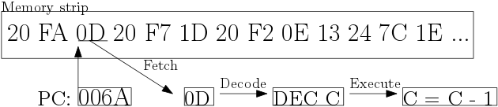

The CPU core
============

Now, you can load a game into memory, but once the gamme is in the memory,
nothing happen. You need to emulate the heart of the Game Boy:
the GPU.
This section is devoted to structuring and writing the CPU core,
the part of the emulater responsible for fetching instructions,
and reproducing the behavior of a single instructions on our memory.

The CPU core is, without a doubt, the place the more
<<propice>> to bugs. CPU cores are hard to debbug and
often made of a big bunch of code (easily more than 1 000 lines).
If you don't feel confortable with developping one, you can
allow yourself to reuse an existing one from a known emulator.
If you want to write yours -- because it's an <<enrichissante>>
experience, and you'll probably learn a lot -- allow yourself to look at
other implementations.
Also, remember you don't need a fully functionnal CPU core to
emulate a specific game. For example, tetris require only a restricted set of
instructions, and their execution don't have to be perfectly faithfull.

States and Registers
--------------------

The execution of a program is basically repeating three
actions : fetching instructions from memory into the CPU core,
decoding the instructions -- 
associating to a binary number a block of code --
and finaly runing the associated block of code.



Those three operations, called the instruction cycle,
are repeated indefinitely until
the `STOP` instruction is executed, or the
power is cut.

Between two instruction cycles,
what change is the internal states of the CPU.
The CPU have a small set of variables, called registers,
that are modified by executing instructions.
Some registers are directly accessibles, and others
are modified thanks to specific instructions.

Our first step in writing a CPU core is then
defining the structure that is going to contain all this states.
We need the registers bits register a, b, c, d, e, h, l and f,
the stack pointer and the program counter.

``` {.rust}
#[derive(PartialEq, Eq, Default, Debug)]
struct Cpu {
    // CPU's registers
	a : u8,
	b : u8,
	c : u8,
	d : u8,
	e : u8,
	h : u8,
	l : u8,
	f : u8,

    // Program counter
    pc : u16,
    // Stack pointer
    sp : u16,
}
```

Since instruction will have to acess both memory and the CPU,
it is easier to give them both through a structure repraisenting
a _virtual machine_.

```
#[derive(PartialEq, Eq, Default, Debug)]
struct Vm {
    cpu : Cpu,
    mmu : Mmu,
}
```

Design of the CPU core
----------------------

The center of the CPU core is the dispatch loop.
This loop fetch the next instruction from the memory located
at the address stored by the __programme counter__,
look for the associated block of code to execute, and then
count the amount of time enlapsed.

First, we need two functions for reading byte
at the address pointed by the __programme counter__.

```
/// Read a byte from the memory pointed by PC, and increment PC
pub fn read_program_byte(vm : &mut Vm) -> u8 {
    let byte = mmu::rb(vm.cpu.pc, &mut vm.mmu);
    vm.cpu.pc += 1;
    return byte;
}

/// Read a word (2bytes) from the memory pointed by PC, and increment PC
pub fn read_program_word(vm : &mut Vm) -> u16 {
    let word = mmu::rw(vm.cpu.pc, &mut vm.mmu);
    vm.cpu.pc += 2;
    return word;
}
```

Notice that in the case of rust, the `+ 1` can create an integer
overflow. If you compile in release mode,
this overflow will just reset the variable back to `0`, which
is the behavior expected from the processor.

Now, we can write the dispatch loop:
``` {.rust}
// The dispatch loop
while true {
    execute_one_instruction(vm);
}

// Execute exactly one instruction by the CPU
//
// The function load the byte pointed by PC, increment PC,
// and call dispatch with the opcode to run the instruction.
fn execute_one_instruction(vm : &mut Vm) {
    // Disable bios once executed
    if vm.cpu.pc >= 0x100 {
        vm.mmu.bios_enabled = false;
    }

    // Fetch the instruction
    let opcode = read_program_byte(vm);

    // Run opcode
    let clock = dispatch(opcode)(vm);

	return clock;
}

```

The `dispatch`  function is actually particuliar.
It get an opcode -- a binary number describing the instruction to execute --
and return a function, which is the code block we have to run
in oder to produce the expected behavior.

Executing instructions
----------------------

### Emulaters are inherently slows ?


# MBC


# Annex A
CPU's registers
# Annex B
CPU Opcode table 1
CPU Opcode table 2

Refs:

* Wikipedia https://en.wikipedia.org/wiki/Instruction_cycle#Decoding_the_instruction
* GBCPUMAN http://marc.rawer.de/Gameboy/Docs/GBCPUman.pdf
* PANDOCS http://bgb.bircd.org/pandocs.htm#lcdinterrupts
* How do I write an emulator http://www.atarihq.com/danb/files/emu_vol1.txt
