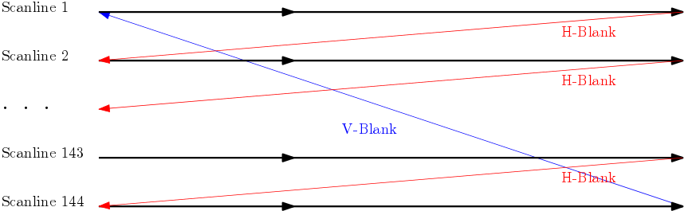

Graphic Process Unit Basics 
===========================

The second main part of a Game Boy emulator is the emulation
of Graphic Process Unit.
The GPU is, in today's computer, a chip on the graphic
card that have the purpose of computing the graphic randering
from the information stored in memory.
In our case, the GPU core of our emulator will be
essentially the code responsible for rendering the pixels of a
160x144 window.

We will introduce a buffer which will play the role of a
virtual screen.
It will contain the color
(white, light grey, dark grey or block) that would be displayed by
a real Game Boy during the run of a game.
The GPU core will have to maintain the color of this screen
up to date during the emulation.

Timings
-------

In the real hardware, the GPU update the pixels line per line.
Drawing a line require access to specific part of memory
which become innaccessible for the CPU.
Therefore the GPU have to respect special timing to
also allow the processor to access this part of memory,
so that the CPU can set the current graphics of the game.

The GPU respect the timing of the old fat cathode-ray tube (CRT) screens.
In this old screen, a ray of electron goes horizontaly through a line.
Then, the ray is turned off, and is moved to the begining off the next line.
When the beam reach the end of the screen, it is moved back to
begining of the top line.



During the Scanline state, which correspond to a crt beam drawing
it's current line, the game boy gpu access
successively the OAM memory 
The diferent states of the CPU core are :

+------------------------------------+--------------------+
| State                              | Duration in cycles |
+====================================+====================+
| Scanline (accessing OAM)           | 80                 |
+------------------------------------+--------------------+
| Scanline (accessing VRAM and OAM)  | 172                |
+------------------------------------+--------------------+
| Horizontal Blank                   | 204                |
+------------------------------------+--------------------+
| Vertical Blank                     | 4560               |
+------------------------------------+--------------------+

The time spend in a Vertical Blank is exactly ten times
the time spend in one line, that is ten times the time spend
in the whole scanline plus the horizontal blank.

To track the diferent states during the execution,
we introduce an enumeration type.

``` {.rust}
#[derive(Eq, PartialEq, Debug)]
pub enum GpuMode {
    /// Horizontable blank mode.
    /// Both OAM and VRAM are accessible.
    HorizontalBlank,
    /// First part of the scanline mode.
    /// The OAM is used and unaccessible from
    /// the CPU.
    ScanlineOAM,
    /// Second part of the scanline mode.
    /// Both OAM and VRAM are used by the GPU
    /// and are unaccessible from the CPU.
    ScanlineVRAM,
    /// Vertical blank mode. Both
    /// OAM and VRAM are accessible.
    VerticalBlank,
}
```

We then introduce a structure containing the divers
state of the GPU, like the index of the current line
it is drawing.

```
#[derive(PartialEq, Eq, Debug)]
/// Represent the memory, registers and flags of the GPU
pub struct Gpu {
    /// Clock (in cycles) used to switch mode
    pub clock           : u64,
    /// Current mode of the GPU
    pub mode            : GpuMode,
    /// Number of the current line
    pub line            : u8,
    /// Memory used for rendering the current screen
    pub rendering_memory        : Vec<u8>,
}
```

Background Window
-----------------


# MBC

# Annex A
CPU's registers
# Annex B
CPU Opcode table 1
CPU Opcode table 2
# Annex C
All the instructions with descriptions

Refs:

* Wikipedia https://en.wikipedia.org/wiki/Instruction_cycle#Decoding_the_instruction
* GBCPUMAN http://marc.rawer.de/Gameboy/Docs/GBCPUman.pdf
* PANDOCS http://bgb.bircd.org/pandocs.htm#lcdinterrupts
* How do I write an emulator http://www.atarihq.com/danb/files/emu_vol1.txt
